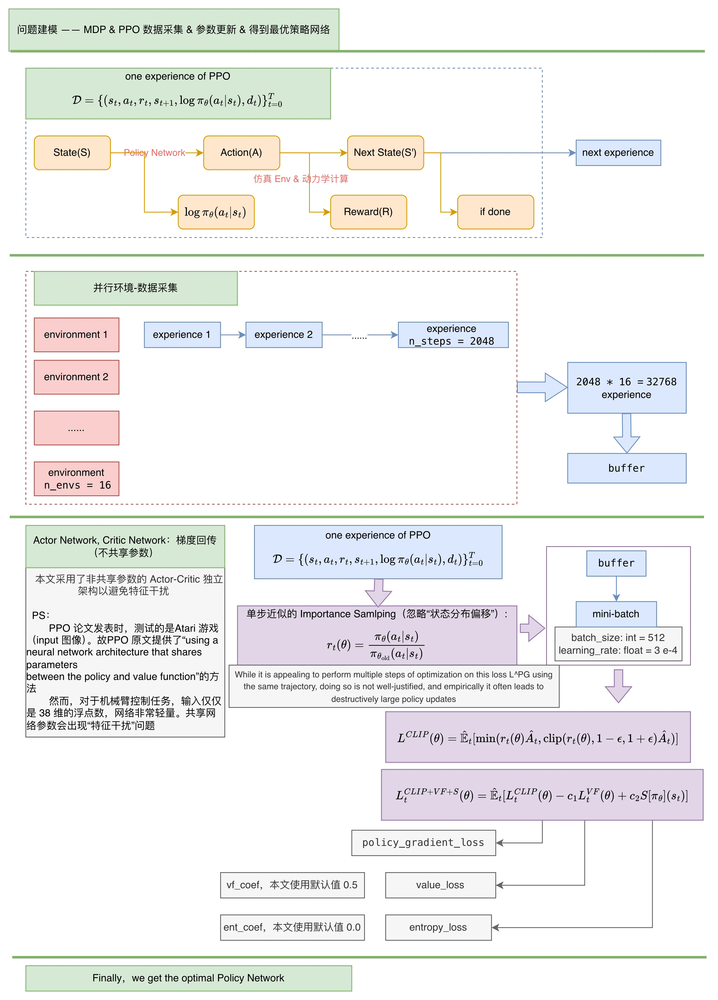

# RL_learn_zq : Hello Embodied AI   —**上海大学 郑群 23122932**  

## 🔥 News & Highlights  
  - **[2026-05-08]**  延伸[Task3]：**梳理理论: Basic ideas of PPO（从理论推理和演进脉络角度）**—— [查看PPT/报告-附录](./Task3_manipulator_bring_ball/reports/Task3.pdf)   
  - **[2026-05-07]**  延伸[Task3]：**梳理项目实现过程："基于 PPO 优化最优策略全过程"数据流**—— [查看流程图-"PPO 数据流"](./Task3_manipulator_bring_ball/show_results/KeyNotes_1.webp)   
  - **[2026-05-06]**  完善[Task3]：**从 0 实现 “平面-机械手：操控物体-跨障-送至目标位置” (基于 MuJoCo & Stable Baselines3)**  
  - **[2026-04-15]**  新增[Task1]：手写强化学习算法，跑通 CartPole，Pendulum  

---

### 🎬 Show results (Task3：debug & final results)  

> 视频存放路径：./Task3_manipulator_bring_ball/show_results

```zsh
# 完整指令示例（演示）
mjpython Task3_manipulator_bring_ball/show.py --wall 0.250 --ball 0.300 0.032 --target -0.250 0.400 --exp_name "v6.1_exp-01_PPO" --choose_model "stages" --match_id stage-3
```

<div align="center">

<p><b>Vedio1_test_环境测试</b></p>
</div>

<br/>

<table style="width: 100%; border-collapse: collapse; border: none;">
  <tr style="border: none;">
    <td width="33.3%" align="center" style="border: none;">
      
      <br><sub>Vedio2_debug_夹爪不闭合</sub>
    </td>
    <td width="33.3%" align="center" style="border: none;">
      
      <br><sub>Vedio3_debug_夹爪提前闭合</sub>
    </td>
    <td width="33.3%" align="center" style="border: none;">
      
      <br><sub>Vedio4_debug_成功包裹但球在手内剧烈震颤</sub>
    </td>
  </tr>
  <tr style="border: none;">
    <td width="33.3%" align="center" style="border: none;">
      
      <br><sub>Vedio5_debug_成功抓住并短时间举起但会掉</sub>
    </td>
    <td width="33.3%" align="center" style="border: none;">
      
      <br><sub>Vedio6_debug_成功送至目标点但没有停下来</sub>
    </td>
    <td width="33.3%" align="center" style="border: none;">
      </td>
  </tr>
</table>

<br/>

<div align="center">

<p><b>Vedio7_第一次成功（对应`--wall 0.00 --exp_name "v6.0_exp-01_PPO" --choose_model "latest" --match_id 69.09`）</b></p>
</div>

<br/>

<table style="width: 100%; border-collapse: collapse; border: none;">
  <tr style="border: none;">
    <td width="50%" align="center" style="border: none;">
      
      <br><sub>Vedio8_wall_0.00（对应`--wall 0.00 --exp_name "v6.1_exp-01_PPO" --choose_model "stages" --match_id stage-0`）</sub>
    </td>
    <td width="50%" align="center" style="border: none;">
      
      <br><sub>Vedio9_wall_0.05（对应`--wall 0.05 --exp_name "v6.1_exp-01_PPO" --choose_model "stages" --match_id stage-1`）</sub>
    </td>
  </tr>
  <tr style="border: none;">
    <td width="50%" align="center" style="border: none;">
      
      <br><sub>Vedio10_wall_0.10（对应`--wall 0.10 --exp_name "v6.1_exp-01_PPO" --choose_model "stages" --match_id stage-2`）</sub>
    </td>
    <td width="50%" align="center" style="border: none;">
      
      <br><sub>Vedio11_wall_0.25（对应`--wall 0.25 --exp_name "v6.1_exp-01_PPO" --choose_model "stages" --match_id stage-3`）</sub>
    </td>
  </tr>
</table>


---

## Task3(Key): 从 0 实现 “平面-机械手：操控物体-跨障-送至目标位置” (基于 MuJoCo & Stable Baselines3)：  

```
rl_learn_zq_native/
├── Task3_manipulator_bring_ball/      # 【Task3】：从 0 实现 “平面-机械手：操控物体-跨障-送至目标位置”
│   ├── xml/                               # 仿真建模
│   │   ├── manipulator_bring_ball.xml     # 核心模型 xml
│   │   └── test_xml.py                    # 核心模型 xml 导入测试
│   ├── outputs/exp_xxx                    # 实验原始结果
│   │   ├── evaluations.npz
│   │   ├── tb_logs/
│   │   ├── best/
│   │   ├── latest/
│   │   └── stages/
│   ├── show_results/                      # 成果展示
│   │   └── *.gif/
│   ├── env.py                             # 自定义：仿真环境封装接口
│   ├── config.py                          # 自定义：全局配置
│   ├── train.py                           # 自定义：训练脚本
│   └── show.py                            # 自定义：演示 & 视频录制脚本
```

**基于 MuJoCo、Gymnasium、 Stable Baselines3，从 0 实现“平面-机械手：操控物体-跨障-送至目标位置”任务**
- 任务描述：“平面-机械手：操控物体-跨障-送至目标位置”为二维平面（x-z）的抓取、避障、搬运任务。智能体（Agent）需要学习一套控制策略，驱动机械臂从随机的初始状态出发，跨越不同高度的障碍墙，准确抓取（或推动）球体，并将其运送至墙另一侧的目标位置。  
- 技术栈：Python / Git; MuJoCo / Gymnasium / Stable Baselines3  
- 原始 xml 模型文件来源：DeepMind Control Suite: Manipulator  

> **本文将“机械手跨障抓取与放置”的时序过程建模成马尔可夫决策过程（Markov Decision Process, MDP），并利用 PPO 算法优化 Policy Network，得到最优解。**  

<div align="center">
  
</div>


### Tensorboard (Task3)  
> 注意：  
> 代码框架 (v1-v6.1) **某些大版本间奖励函数的定义差异较大，没有可比性**  

``` zsh
cd projects_mac/own/rl_learn_zq_native/
conda activate rl_learn
tensorboard --logdir=Task3_manipulator_bring_ball/outputs/
```

### 实验结果展示 & 录制 (Task3)  

> 注意：  
> 1. 如果不能调用 mjpython 可以尝试 python(非 MacOS 建议先尝试 python 调用)  
> 2. 建议先通过 --help 指令获取：**“train 阶段使用的参数“**；**“详细的指令和推荐的范围“**  
> 3. 代码框架 (v1-v6.1) **版本不向前兼容**，如果要 show 之前的实验结果可以通过 git 历史回溯  

```zsh
mjpython Task3_manipulator_bring_ball/show.py --help
```

```zsh
# 最简化示例
# 注意--exp_name别错了！！！在 outputs 文件夹里
mjpython Task3_manipulator_bring_ball/show.py --exp_name "v6.1_exp-01_PPO" --choose_model "stages" --match_id stage-3
```

```zsh
# 完整指令示例（演示）
mjpython Task3_manipulator_bring_ball/show.py --wall 0.250 --ball 0.300 0.032 --target -0.250 0.400 --exp_name "v6.1_exp-01_PPO" --choose_model "stages" --match_id stage-3
```

```zsh
# 完整指令示例（录制）
mjpython Task3_manipulator_bring_ball/show.py --wall 0.250 --ball 0.300 0.032 --target -0.250 0.400 --exp_name "v6.1_exp-01_PPO" --choose_model "stages" --match_id stage-3 --mode video --fps 100
```

---

**Task1: 基于手写算法，跑通 CartPole，Pendulum，并观察结果。从而感受各个算法的性能并了解底层组件的定义**：  

```
rl_learn_zq_native/
├── Task1_myAlgo/       # 【Task1】：基于手写算法，跑通 CartPole，Pendulum，并观察结果。从而感受各个算法的性能并了解底层组件的定义。          
│   ├── CartPole.ipynb/           # 对比离散型动作输出算法；DQN，Actor-Critic，TPRO-concrete，PPO-concrete，SAC-concrete
│   └── Pendulum.ipynb/           # 对比连续型动作输出算法：TPRO-continuous，PPO-continuous，SAC-continuous  
├── src/                # 手写 RL 算法库
│   ├── agents/                   # PPO, SAC, DQN, TRPO 等
│   └── utils/                    # 工具函数 & 神经网络骨架(Actor/Critic)对比
```

- 任务概述：基于手写算法，跑通 CartPole，Pendulum，并观察结果。从而感受各个算法的性能并了解底层组件的定义。  
    - CartPole：对比离散型动作输出算法： DQN，Actor-Critic，TPRO-concrete，PPO-concrete，SAC-concrete  
    - Pendulum：对比连续型动作输出算法： TPRO-continuous，PPO-continuous，SAC-continuous  

> 手写算法核心逻辑参考：上海交通大学 张伟楠 《动手学强化学习》 & https://github.com/boyu-ai/Hands-on-RL    

**Task2【删除】**：   
**Task4【删除】**:  

---

## 环境配置
### Macbook M5环境配置（**Native**）
```zsh
conda create -n rl_learn python=3.10 -y
conda activate rl_learn

pip install torch==2.7.0 torchvision==0.22.0 torchaudio==2.7.0
pip install -r requirements.txt

# setuptools默认版本可能和 tensorboard 不适配，手动降版本
pip install "setuptools<70"
```

```zsh
# 验证 mps
export KMP_DUPLICATE_LIB_OK=TRUE
python -c "import torch; print(torch.__version__); print(torch.backends.mps.is_available())"
``` 

### 其他可选项

> Mac: (可选)录制视屏  
```zsh
# (可选) Mac 录制视屏
brew install ffmpeg
```

```zsh
# mov 转 gif
for f in *.mov; do ffmpeg -i "$f" -vf "fps=18,scale=-1:600" -sws_flags lanczos -fps_mode cfr -an "${f%.mov}.gif"; done
```

> WSL/Windows: Install pytorch  
```bash
#  示例：WSL/Windows + RTX 5060Ti (sm_120)：CUDA 12.8 | torch 2.7.0
# 避免--index-url指令冲突。不在requirements中安装
pip install torch==2.7.0 torchvision==0.22.0 torchaudio==2.7.0 --index-url https://download.pytorch.org/whl/cu128
```
