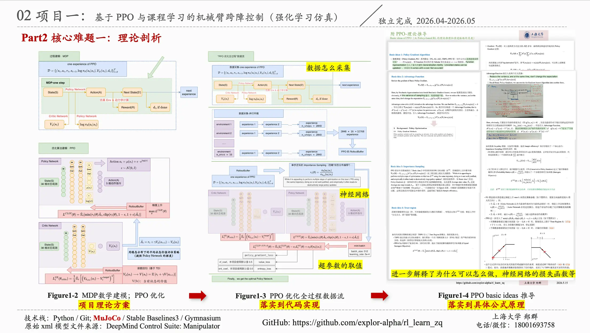
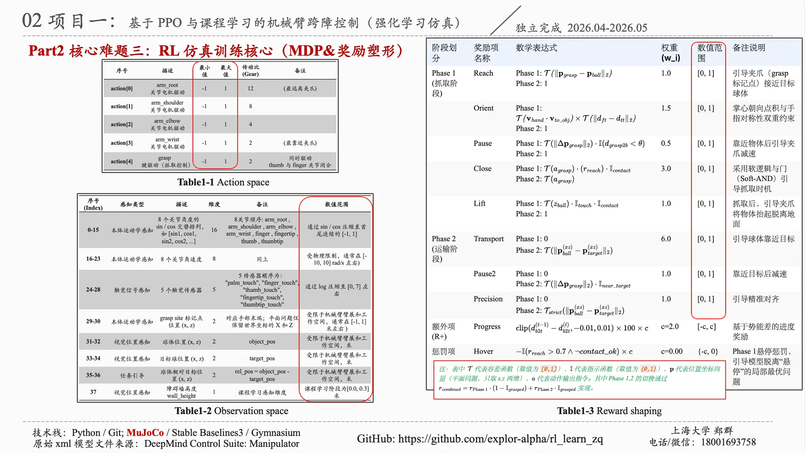
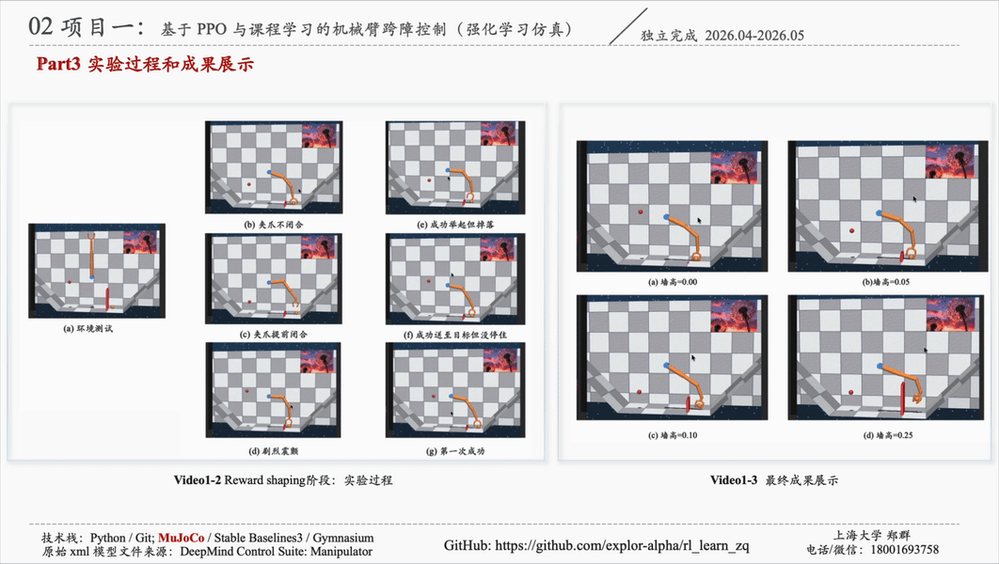

# RL_learn_zq : Hello Embodied AI   —**上海大学 郑群**  

## Task3 项目介绍：

**项目概述**：从 0 实现“平面-机械手：操控物体-跨障-送至目标位置”机械臂控制任务的 RL 仿真训练部署。
> - 仿真平台/物理引擎：MuJoCo；
> - 工具库：强化学习标准算法库 Stable Baselines3；
> - 算法：PPO(Proximal Policy Optimization)；
> - 原始 xml 模型文件来源：DeepMind Control Suite: Manipulator

**主要内容**：

<div align="center">

<p><b></b></p>
</div>
<div align="center">

<p><b></b></p>
</div>

**结果展示**：

<div align="center">

<p><b></b></p>
</div>


**文件结构**：

```
rl_learn_zq_native/
├── Task3_manipulator_bring_ball/          # 【Task3】：从 0 实现 “平面-机械手：操控物体-跨障-送至目标位置”
│   │
│   ├── xml/                               
│   │   ├── manipulator_bring_ball.xml     # 核心：xml 模型文件
│   │   └── test_xml.py     # xml 导入测试
│   ├── env.py                             # 核心：仿真环境封装接口（自定义）
│   ├── config.py                          # 核心：全局配置（自定义）
│   ├── train.py                           # 核心：训练脚本（自定义）
│   ├── show.py                            # 核心：演示 & 视频录制脚本（自定义）
│   │
│   ├── outputs/exp_xxx     # 实验结果结构化保存
│   │   ├── latest/
│   │   ├── stages/
│   │   ├── best/
│   │   ├── tb_logs/
│   │   └── evaluations.npz
│   │
│   └── show_results/       # 成果展示
│       └── *.gif
```

---

## Quick Start（Task3）
### Macbook M5环境配置（**Native**）
```zsh
conda create -n rl_learn python=3.10 -y
conda activate rl_learn

pip install torch==2.7.0 torchvision==0.22.0 torchaudio==2.7.0
pip install -r requirements.txt

# setuptools默认版本可能和 tensorboard 不适配，手动降版本
pip install "setuptools<70"
```

```zsh
# 验证 mps
export KMP_DUPLICATE_LIB_OK=TRUE
python -c "import torch; print(torch.__version__); print(torch.backends.mps.is_available())"
``` 

### WSL/Windows: Install pytorch  
```bash
# 示例：WSL/Windows + RTX 5060Ti (sm_120)：CUDA 12.8 | torch 2.7.0
# 避免--index-url指令冲突。不在requirements中安装
pip install torch==2.7.0 torchvision==0.22.0 torchaudio==2.7.0 --index-url https://download.pytorch.org/whl/cu128
```

### Tensorboard
> 注意：  
> 代码框架 (v1-v6.1) **某些大版本间奖励函数的定义差异较大，没有可比性**  

``` zsh
cd projects_mac/own/rl_learn_zq_native/
conda activate rl_learn
tensorboard --logdir=Task3_manipulator_bring_ball/outputs/
```

### 实验结果展示 & 录制

> 注意：  
> 1. 如果不能调用 mjpython 可以尝试 python(非 MacOS 建议先尝试 python 调用)  
> 2. 建议先通过 --help 指令获取：**“train 阶段使用的参数“**；**“详细的指令和推荐的范围“**  
> 3. 代码框架 (v1-v6.1) **版本不向前兼容**，如果要 show 之前的实验结果可以通过 git 历史回溯  

```zsh
mjpython Task3_manipulator_bring_ball/show.py --help
```

```zsh
# 最简化示例
# 注意--exp_name别错了！！！在 outputs 文件夹里
mjpython Task3_manipulator_bring_ball/show.py --exp_name "v6.1_exp-01_PPO" --choose_model "stages" --match_id stage-3
```

```zsh
# 完整指令示例（演示）
mjpython Task3_manipulator_bring_ball/show.py --wall 0.250 --ball 0.300 0.032 --target -0.250 0.400 --exp_name "v6.1_exp-01_PPO" --choose_model "stages" --match_id stage-3
```

```zsh
# 完整指令示例（录制）
mjpython Task3_manipulator_bring_ball/show.py --wall 0.250 --ball 0.300 0.032 --target -0.250 0.400 --exp_name "v6.1_exp-01_PPO" --choose_model "stages" --match_id stage-3 --mode video --fps 100
```

---

### 其他备注

> Mac: (可选)录制视屏  
```zsh
# (可选) Mac 录制视屏
brew install ffmpeg
```

```zsh
# mov 转 gif
for f in *.mov; do ffmpeg -i "$f" -vf "fps=18,scale=-1:600:flags=lanczos,split[s0][s1];[s0]palettegen[p];[s1][p]paletteuse" -vsync 1 -an "${f%.mov}.gif"; done

# mp4 转 gif
for f in *.mp4; do ffmpeg -i "$f" -vf "fps=18,scale=-1:600:flags=lanczos,split[s0][s1];[s0]palettegen[p];[s1][p]paletteuse" -vsync 1 -an "${f%.mp4}.gif"; done
```

---

**Task1: RL 手写算法**

> 核心逻辑参考：上海交通大学 张伟楠 《动手学强化学习》 & https://github.com/boyu-ai/Hands-on-RL    

**Task2【删除】**：   
**Task4【删除】**:  
